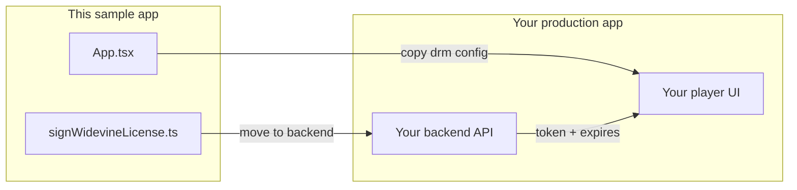

# Gumlet DRM Video Playback Example for React Native

This repository is a **reference sample** — a minimal, runnable app that shows how to play Gumlet DRM-protected streams with [`react-native-video`](https://github.com/react-native-video/react-native-video) on iOS (FairPlay) and Android (Widevine).

Use it to understand the integration patterns, test your Gumlet DRM setup, and copy the relevant code into your own React Native application.

**This repo is:**

- A working demo with platform-specific form fields for pasting stream and licence values
- A starting point for custom native player integrations

**This repo is not:**

- A published npm package or production-ready player SDK
- A substitute for [`@gumlet/react-native-embed-player`](https://www.npmjs.com/package/@gumlet/react-native-embed-player) (Gumlet's WebView-based embed player)

### Key files to study

| File | Purpose |
|---|---|
| [`App.tsx`](App.tsx) | `react-native-video` `source` and `drm` configuration per platform |
| [`utils/signWidevineLicense.ts`](utils/signWidevineLicense.ts) | Gumlet licence-proxy HMAC signing (Android demo only) |



---

## Prerequisites

Before starting, set up your local development environment according to the [React Native Environment Setup Guide](https://reactnative.dev/docs/environment-setup).

| Requirement | Notes |
|---|---|
| React Native 0.76+ (as pinned in [`package.json`](package.json)) | Match or test against your own RN version |
| `react-native-video` ^6.7 | Sample uses the v6 `DRMType` / `source.drm` API — v7 has a different DRM plugin API |
| **Physical iOS device** | FairPlay does **not** work on the iOS Simulator (Apple limitation) |
| **Physical Android device** (recommended) | Widevine may work on emulators, but real-device testing is strongly advised |
| Gumlet account with DRM enabled | FairPlay credentials uploaded; asset transcoded with DRM keys |

---

## Running the sample app

### Step 1: Install dependencies

```bash
npm install
# or
yarn install
```

### Step 2: iOS CocoaPods setup (iOS only)

```bash
cd ios
pod install
cd ..
```

### Step 3: Run the application

**iOS** (use a physical device for DRM):

```bash
npm run ios
# or
yarn ios
```

**Android:**

```bash
npm run android
# or
yarn android
```

### Using the demo UI

1. Launch the app — platform-specific fields appear automatically.
2. Paste your Gumlet stream and licence values (see [Configuration](#configuration) below).
3. Tap **Play Video** — the app builds a `source` object and mounts `<Video />`.
4. Tap **Stop Video** — clears `source` and unmounts the player.

The text inputs are **demo-only**. In production, fetch stream URLs and signed licence URLs from your backend at playback time.

---

## Where to get Gumlet values

| Field | URL pattern |
|---|---|
| iOS stream | HLS manifest, e.g. `https://video.gumlet.io/<collection>/<asset>/main.m3u8` |
| iOS FairPlay licence | `https://fairplay.gumlet.com/licence/<ORG_ID>/<ASSET_ID>` |
| iOS FairPlay certificate | `https://fairplay.gumlet.com/certificate/<ORG_ID>` |
| Android stream | DASH manifest, e.g. `https://video.gumlet.io/<collection>/<asset>/main.mpd` |
| Android Widevine licence proxy | `https://widevine.gumlet.com/licence/<ORG_ID>/<ASSET_ID>` |

From the **Gumlet DRM Dashboard**, obtain:

- **`licence_url_sign_secret`** — Base64 HMAC key used to sign **both** FairPlay and Widevine licence URLs
- Staging vs production hosts (some orgs use `widevine-stage.gumlet.com` instead of `widevine.gumlet.com`)

Replace `<ORG_ID>` with your organisation ID and `<ASSET_ID>` with the Gumlet video asset ID.

---

## Configuration

To play your DRM streams in the demo, fill in the following fields in the app interface.

### iOS — FairPlay + HLS

| Field | Description |
|---|---|
| **HLS URL** | The `.m3u8` stream URL for the video |
| **FairPlay licence URL** | Licence server URL **including** `?token=...&expires=...` (the sample does not sign this at runtime — paste a pre-signed URL) |
| **FairPlay certificate URL** | Org-level certificate endpoint (`https://fairplay.gumlet.com/certificate/<ORG_ID>`) |

The sample uses a custom `getLicense` hook ([`App.tsx`](App.tsx)) that:

1. POSTs JSON `{ spc: "<base64 SPC>" }` to the licence URL
2. Expects a JSON response with a `ckc` field
3. Returns `ckc` to `react-native-video`

### Android — Widevine + DASH

| Field | Description |
|---|---|
| **MPD URL** | The MPEG-DASH `.mpd` stream URL. Widevine is not supported on HLS `.m3u8` in standard Android environments — use DASH. |
| **Widevine licence proxy URL** | Base licence URL without query params. Format: `https://widevine.gumlet.com/licence/<ORG_ID>/<ASSET_ID>`. The app appends `token` and `expires`. |
| **Widevine proxy secret (Base64)** | Your org's `licence_url_sign_secret` from the Gumlet DRM Dashboard |
| **Token lifetime (seconds)** | Validity window for the signature token (default: 30 seconds) |

Android playback also requires `source.type = 'mpd'` — see [`App.tsx`](App.tsx).

---

## Licence URL signing

Gumlet requires each licence request to be authenticated with an HMAC-SHA1 signature. The canonical algorithm (used by Gumlet's embed player and API) is:

```
expires = round(now + lifetime_ms)          // milliseconds since epoch
stringToSign = "/<ORG_ID>/<ASSET_ID>?expires=<expires>"
token = HMAC-SHA1(Base64_decode(secret), stringToSign) as hex
licenceUrl = "<base_licence_url>?token=<token>&expires=<expires>"
```

Reference implementation: [`utils/signWidevineLicense.ts`](utils/signWidevineLicense.ts).

Steps in detail:

1. **Extract the path** — strip protocol, host, and `/licence/` prefix to get `<ORG_ID>/<ASSET_ID>`
2. **Calculate expiration** — `now + token_lifetime` in **milliseconds**
3. **Build the message** — `/<ORG_ID>/<ASSET_ID>?expires=<expiration_timestamp>`
4. **HMAC-SHA1** — sign with the Base64-decoded `licence_url_sign_secret`
5. **Append parameters** — `?token=<hex_signature>&expires=<expiration_timestamp>`

### Important: iOS vs Android signing in this sample

| Platform | Signing in this sample | Production expectation |
|---|---|---|
| Android | Client-side at Play tap (demo convenience) | **Backend** signs before playback |
| iOS | User pastes a pre-signed licence URL | **Backend** signs using the same algorithm |

The same `licence_url_sign_secret` and algorithm apply to **both** FairPlay and Widevine licence URLs.

---

## Integrating into your own app

### What to copy

**iOS `source` object** — from [`App.tsx`](App.tsx):

```tsx
{
  uri: hlsUrl,
  drm: {
    type: DRMType.FAIRPLAY,
    licenseServer: signedFairplayLicenceUrl,
    certificateUrl: fairplayCertUrl,
    getLicense: (spcString, _contentId, licenseUrl) =>
      fetch(licenseUrl, {
        method: 'POST',
        headers: { 'Content-Type': 'application/json' },
        body: JSON.stringify({ spc: spcString }),
      })
        .then(r => r.json())
        .then(r => r.ckc),
  },
}
```

**Android `source` object:**

```tsx
{
  uri: mpdUrl,
  type: 'mpd',
  drm: {
    type: DRMType.WIDEVINE,
    licenseServer: signedWidevineLicenceUrl,
  },
}
```

You can also port the signing logic from [`utils/signWidevineLicense.ts`](utils/signWidevineLicense.ts) — but see the production notes below.

### What to adapt for production

1. **Remove demo TextInputs** — fetch the stream URL and signed licence URL (or signing inputs) from your API at playback time.
2. **Move signing to your backend** — never ship `licence_url_sign_secret` in the mobile app. The sample signs client-side only for convenience. In production, your API returns `{ token, expires }` and the client appends them to the licence URL.
3. **Sign FairPlay licence URLs server-side** — same HMAC algorithm as Widevine; the iOS sample currently expects you to provide the full signed URL.
4. **Handle token expiry** — the default 30-second lifetime is for demo use. Re-sign or re-fetch from your API before licence requests fail on long sessions, seeks, or rebuffers.
5. **Playback URL signing is separate** — if your collection has `signed_url` protection enabled, the **stream URL** (`.m3u8` / `.mpd`) needs its own HMAC signature using `signed_url_secret` (a different algorithm: pathname + expiry in **seconds**). This sample does **not** demonstrate stream URL signing.
6. **Error handling** — replace `Alert.alert` with your app's error UX; log licence HTTP status codes for debugging.
7. **`react-native-video` version** — this sample targets v6. v7 uses the `@react-native-video/drm` plugin with a different API; adapt accordingly if upgrading.

---

## Caveats and gotchas

### Platform and format

- iOS = HLS + FairPlay; Android = DASH + Widevine. Do not use `.m3u8` for Widevine on Android.
- Android must set `source.type = 'mpd'`.
- FairPlay requires a real iOS device — the simulator will fail.

### Licence signing

- `expires` is in **milliseconds** (not seconds).
- The secret is **Base64-encoded** before HMAC.
- The Widevine proxy URL must have **no existing query params** before signing.
- The signing string is `/<ORG_ID>/<ASSET_ID>?expires=...` — no host, no `/licence/` prefix in the HMAC input.
- iOS and Android share the same `licence_url_sign_secret`.

### FairPlay `getLicense`

- Gumlet expects request body `{ spc: "..." }` and response `{ ckc: "..." }`.
- 403 or 415 errors usually mean invalid Content-Type, missing `token`/`expires` on the licence URL, or an expired signature.

### Security

- Do not commit secrets or hardcode org credentials in your app.
- Client-side signing in this sample is **not** a security model — extract the algorithm and implement it on your server.

### Dependencies and naming

- The internal Xcode project is still named `FairplayDRMExample` — cosmetic only; safe to rename when forking.
- `crypto-js` is used because React Native lacks Node's `crypto` module. Your backend should use native `crypto` or OpenSSL.

### Testing

- Use Reactotron ([`ReactotronConfig.js`](ReactotronConfig.js)) to inspect licence network requests during development.
- Test with a DRM-enabled asset that has completed transcoding.

---

## Troubleshooting

| Symptom | Likely cause |
|---|---|
| iOS playback fails immediately | Testing on simulator; invalid or expired licence URL; missing certificate URL |
| Android "Failed to sign" alert | Invalid Base64 secret or malformed proxy URL |
| 403 on licence request | Wrong HMAC, expired `expires`, or secret rotated in dashboard |
| Video loads but black screen / decode error | Wrong stream format (HLS on Android); unsigned playback URL when `signed_url` is enabled |
| `getLicense` error on iOS | Licence URL missing `token`/`expires`; server returned non-JSON or missing `ckc` |

---

## Alternative approach: `@gumlet/react-native-embed-player`

If you do not need direct `react-native-video` integration, consider [`@gumlet/react-native-embed-player`](https://www.npmjs.com/package/@gumlet/react-native-embed-player):

- WebView-based Gumlet embed player for React Native
- Accepts `drm_token` and `expires` from your backend as props (see its [README](https://github.com/gumlet/react-native-embed-player/blob/main/README.md))
- Gumlet-hosted player UI, controls, and embed features out of the box

**Choose the embed player** if you want a hosted player experience with minimal native video code.

**Choose this sample** if you need a custom native player, offline hooks, or full control over the video surface.

---

## Related links

- [react-native-video](https://github.com/react-native-video/react-native-video) — v6 source-based DRM configuration
- [React Native environment setup](https://reactnative.dev/docs/environment-setup)
- [Gumlet](https://www.gumlet.com) — dashboard and documentation
